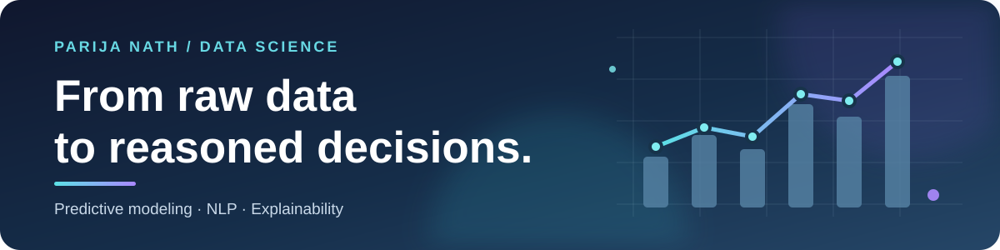

# Hi, I'm Parija 👋

  
  

I'm a data scientist who likes models with receipts: a clear baseline, a fair evaluation, and an explanation someone can challenge. I have an M.S. in Bioinformatics and build across banking, supply chains, and public health data. I'm open to Data Scientist and Applied ML roles, especially in financial services.

## 🚀 Things I've built

| | Project | What you'll find |
| :---: | --- | --- |
| 🏦 | [Banking Product Propensity Modeling](https://github.com/Paarija/banking-product-propensity-modeling) | Transaction-sequence transformer vs. gradient boosting on anonymized banking data, with client-disjoint evaluation and a local Streamlit dashboard. [Results and limitations](https://github.com/Paarija/banking-product-propensity-modeling/blob/main/docs/results.md). |
| 🚚 | [Supplier Risk Intelligence](https://github.com/Paarija/supplier-risk-intelligence) | Supplier performance + disruption-news NLP → calibrated, explainable risk ranking by expected loss. Synthetic demo benchmarks, SHAP, and Streamlit. |
| 🧪 | [Clinical Safety Intelligence](https://github.com/Paarija/clinical-safety-intelligence) | FAERS safety-signal ranking with ROR/PRR, followed by quality-gated FDA, PubMed, and trial evidence synthesis using LangGraph and Gemini. |
| 💬 | [Text2SQL Studio](https://github.com/Paarija/Automated-SQL-Querying-and-Insights-Generator-LLM-Python-) | Natural-language questions → read-only SQL, query validation, and an evaluation workflow. |

> 📈 **A result with context:** In one fixed 5,000-client banking experiment, buyer-only hit@1 was **52.4%** for the transformer vs. **41.1%** for the baseline. The test fold had 124 buyer-month examples, so this is exploratory—not production performance. [See the method and caveats](https://github.com/Paarija/banking-product-propensity-modeling/blob/main/docs/results.md).

## 🧰 My toolkit

- **Data + modeling:** `Python` · `SQL` · `Pandas` · `NumPy` · `scikit-learn` · `XGBoost` · `PyTorch`
- **NLP + LLM workflows:** `Hugging Face Transformers` · `LangGraph` · `Gemini API`
- **Apps + evaluation:** `Streamlit` · `Plotly` · `SHAP` · `Pytest` · `Git`

<em>Curious about a project? Start with its README—or say hello above.</em>

